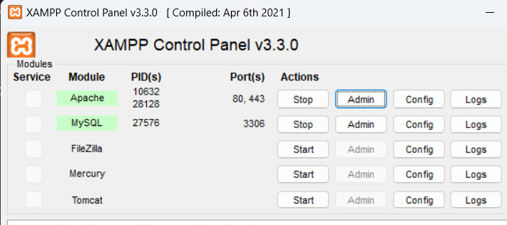

# Proyecto-TallerdeProgramacion-utp  UTPastry - Tu Destino Dulce 🍰


¡Bienvenido a UTPastry, donde tus sueños dulces se hacen realidad! 🎂


## Descripción del Proyecto

UTPastry es una tienda de pasteles que se esfuerza por llevar la felicidad a través de cada bocado. Nuestros chefs expertos elaboran pasteles exquisitos con ingredientes de alta calidad y una pasión inigualable por la repostería. Desde pasteles clásicos hasta creaciones personalizadas, en UTPastry encontrarás la elección perfecta para cualquier ocasión.

## Características Principales

- **Variedad de Sabores:** Desde el clásico chocolate hasta opciones más exóticas, ofrecemos una amplia gama de sabores para satisfacer todos los gustos.

- **Personalización:** ¿Tienes una idea única en mente? ¡Hacemos realidad tus sueños! Personaliza tu pastel para que sea tan especial como la ocasión que estás celebrando.

- **Entrega Rápida:** Nos esforzamos por hacer que tus momentos especiales sean aún más memorables. Ofrecemos entregas rápidas y confiables para que tus pasteles lleguen frescos y deliciosos.


# Instalación

1. Abrir la terminal y clonar el Repositorio en el Directorio de XAMPP/htdocs.

    ```bash
    cd C:/xampp/htdocs
    ```
    ```bash
    git clone https://github.com/StevenCiri/Taller-ProgramacionWeb-utp.git
    ```
2. Asegúrese de tener XAMPP activado. Inicie Apache y MySQL desde el panel de control de XAMPP.

    

3. La aplicación estará disponible en http://localhost/Taller-ProgramacionWeb-utp/index.html

## Contribución

¡Estamos abiertos a contribuciones! Si tienes ideas para mejorar UTPastry, no dudes en abrir un problema o enviar una solicitud de extracción.

## Contacto

¿Preguntas, sugerencias o simplemente quieres hablar de pasteles? ¡Estamos aquí para ti!

- Correo Electrónico: info@utpastry.com
- Sitio Web: [https://www.utpastry.com](https://www.utpastry.com)
- Redes Sociales: [@UTPastry en Instagram](https://www.instagram.com/utpastry)

## Agradecimientos

Quisieramos expresar nuestro mas sincero agradecimiento al Profesor Ingeniero UNI Adolfo Jorge Prado Ventocilla por su orientación, apoyo, conocimientos invaluable y valiosos consejos durante el desarrollo de este proyecto.

---

¡Gracias por elegir UTPastry para endulzar tus momentos especiales! 🎉
